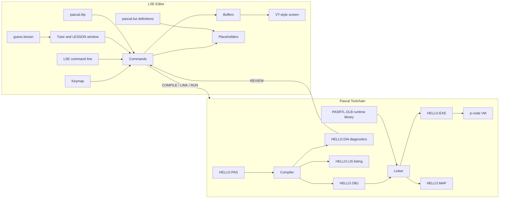

# LSE-style Pascal Editor

## Decisions so far

- **Language supported:** a teaching-sized Pascal subset, roughly Wirth's Pascal-S plus VAX Pascal-style `MODULE` for separate compilation.
- **Keys and look:** modern keybindings with a VT100/VT220 look and feel.
- **Toolchain:** real COMPILE, then LINK (symbolic), then RUN, all usable from inside the editor and from a shell.
- **Stack (assumed):** Python 3.11+, standard library `curses`, no runtime dependencies. Tests use `pytest`.
- **Audience:** people who don't know Pascal. The editor teaches lightly as you go and includes a guided first program, "Guess My Number", which takes the user from an empty file to a game they compile, link, run and play.

## Architecture



## Project layout

- `lse/`: the editor
  - `app.py`: main loop and startup (`lse HELLO.PAS`)
  - `screen.py`: curses rendering: windows, status line, message area, DEC line-drawing borders
  - `buffer.py`: line-based text buffer, undo/redo, VMS-style versioned save (`HELLO.PAS;1`, `;2`, and so on)
  - `windows.py`: up to two split windows, plus the REVIEW and `$OUTPUT` buffers
  - `keymap.py`: the modern key profile, mapping key codes to command names
  - `commands.py`: command registry and the `LSE>` command-line parser (`COMPILE`, `REVIEW`, `GOTO FILE`, `EXIT`, ...)
  - `placeholders.py`: finding, navigating, expanding and erasing placeholders; token expansion; menu popups
  - `langdef.py`: parser for the `DEFINE LANGUAGE / TOKEN / PLACEHOLDER` file format
  - `languages/pascal.lse`: Pascal templates, each with a description and example
  - `tutor.py`: lesson runner: LESSON window, step checks, hint, "show me"
  - `lessons/guess.lesson`: the Guess My Number tutorial
  - `help/pascal.hlp`: VMS-style help library (`HELP PASCAL IF`, `HELP PASCAL LOOPS`, ...)
- `pascal/`: the toolchain
  - `lexer.py`, `parser.py` (recursive descent producing an AST), `semantic.py` (symbol tables, type checking)
  - `codegen.py`: AST to p-code
  - `objfile.py`: the `.OBJ` / `.EXE` text formats
  - `linker.py`: symbol resolution, relocation, `.MAP` output
  - `vm.py`: stack machine with static links for nested procedures
  - `rtl.py`: runtime library routines (`PAS$WRITELN`, `PAS$READLN`, ...)
  - `messages.py`: VMS-style messages (`%PASCAL-E-UNDECLID, ...`), each with a plain-English explanation and hint
  - `cli.py`: DCL-like entry points: `pascal HELLO`, `link HELLO`, `run HELLO`
- `examples/`: `HELLO.PAS`, `GUESS.PAS` (the finished tutorial program), `FACTORIAL.PAS`, `PRIMES.PAS`, and a two-module example for LINK
- `tests/`: compiler, linker, VM, placeholder engine and buffer tests
- `README.md`, `pyproject.toml`

## Look and feel (modern keys, VT200 look)

```
+------------------------------------------------------------------------------+
| PROGRAM Hello(OUTPUT);                                                       |
| VAR i : INTEGER;                                                             |
| BEGIN                                                                        |
|   FOR i := 1 TO 10 DO                                                        |
|     %{statement}%                                                            |
| END.                                                                         |
|                                                                              |
|[ HELLO.PAS;2 ]------------------------[ Pascal | Insert | Forward | 5/6 ]----|
| %LSE-I-WRITTEN, 6 lines written to file HELLO.PAS;2                          |
| LSE> COMPILE                                                                 |
+------------------------------------------------------------------------------+
```

- An EVE-style status line in reverse video, a message line using VMS message format, and an `LSE>` prompt
- Borders drawn with curses ACS / DEC Special Graphics characters
- Themes: `SET THEME VT220` (white on black, the default), `AMBER` and `GREEN` phosphor
- Default 80-column layout with a ruler option; the screen adapts to larger terminals
- The F1 help screen draws the classic VT keypad diagram, labeled with the modern key equivalents

**Modern key profile**

- Tab: expand the token under the cursor, or go to the next placeholder. Shift-Tab: previous placeholder.
- Ctrl-Delete or Ctrl-K: erase placeholder (an optional placeholder disappears together with its separator)
- Ctrl-S save, Ctrl-Q quit (prompts if there are unsaved changes), Ctrl-Z / Ctrl-Y undo and redo
- Ctrl-F find, F3 find next, Ctrl-G go to line
- Ctrl-P or F10: `LSE>` command line
- F5 compile, link and run; F7 compile only; F8 / Shift-F8 next or previous error (REVIEW)
- Ctrl-W switch window, Ctrl-B buffer list

## Placeholders in Pascal

Pascal already uses `{ }` for comments and `[ ]` for arrays, so placeholders use LSE's alternate delimiters:

- `%{name}%`: required
- `%[name]%`: optional
- `...` after a placeholder: repeatable list

Example definitions in `pascal.lse`:

```
DEFINE TOKEN WHILE /LANGUAGE=PASCAL
  "WHILE %{boolean_expression}% DO"
  "  %{statement}%"
END DEFINE

DEFINE PLACEHOLDER statement /LANGUAGE=PASCAL /TYPE=MENU
  "assignment"  /PLACEHOLDER
  "BEGIN"       /TOKEN
  "IF"          /TOKEN
  "WHILE"       /TOKEN
  "FOR"         /TOKEN
  "REPEAT"      /TOKEN
  "CASE"        /TOKEN
  "WRITELN"     /TOKEN
  "procedure_call" /PLACEHOLDER
END DEFINE
```

Tokens to define: `PROGRAM`, `MODULE`, `CONST`, `TYPE`, `VAR`, `PROCEDURE`, `FUNCTION`, `BEGIN`, `IF`, `CASE`, `WHILE`, `REPEAT`, `FOR`, `WRITELN`, `READLN`, `RECORD`, `ARRAY`.

The compiler recognizes leftover placeholders and reports `%PASCAL-E-PLACEHOLDER, unexpanded placeholder %{statement}%`. REVIEW then takes you to it.

## Pascal subset (version 1)

- **Included:**
  - `PROGRAM` and `MODULE` units
  - `CONST`, `TYPE`, `VAR`
  - Types: `INTEGER`, `REAL`, `BOOLEAN`, `CHAR`, subranges, `ARRAY`, `RECORD`
  - Procedures and functions with value and `VAR` parameters, nesting and recursion
  - Statements: `IF`/`ELSE`, `CASE`, `WHILE`, `REPEAT`, `FOR` (`TO` / `DOWNTO`)
  - I/O: `WRITE`, `WRITELN` with field widths, `READ`, `READLN`; string literals
  - Standard functions: `ABS SQR ODD ORD CHR SUCC PRED TRUNC ROUND SQRT`
  - Extension for the game: `RANDOMIZE` and `RANDOM(n)` (returns 0 to n-1), supplied by `PAS$RANDOM` in `PASRTL`. `RUN/SEED=n` makes runs repeatable for tests.
  - Separate compilation: VAX-style `[GLOBAL]` and `[EXTERNAL]` attributes
- **Deferred:** pointers, sets, files other than INPUT/OUTPUT, `WITH`, `GOTO`

## COMPILE, LINK, RUN

- **COMPILE** (`PASCAL HELLO`, or `COMPILE` in LSE)
  - Writes `HELLO.OBJ`: a readable text object file containing the module name, p-code with symbolic operands, a `GLOBALS` table (exported symbols and offsets), an `EXTERNALS` table (imports plus fixup sites) and line-number debug records.
  - Writes `HELLO.DIA`: diagnostics with file, line and column, which drive REVIEW.
  - Writes `HELLO.LIS` when `/LIST` is given.
  - Error messages look like `%PASCAL-E-UNDECLID, undeclared identifier "COUNT" at line 12`.
- **LINK** (`LINK HELLO, MATHLIB`)
  - Concatenates the code segments, relocates addresses and resolves externals against the other objects and `PASRTL.OLB`.
  - Missing symbols produce `%LINK-W-UNDFSYMS`.
  - Writes `HELLO.EXE`: a resolved image with its entry point.
  - Writes `HELLO.MAP`: a VMS-style map listing every symbol, its module and address.
- **RUN** (`RUN HELLO`, or F5)
  - Suspends the screen (like SPAWN), runs the VM in the real terminal so `READLN` works, then shows "Press RETURN to continue".
  - Output is also captured into the `$OUTPUT` buffer.
  - Runtime errors print `%PAS-F-DIVBYZERO` followed by a `%TRACE-F-TRACEBACK` symbolic dump giving procedure names and source line numbers.

## Learning Pascal inside LSE

The teaching comes in three layers, from always-on to fully guided.

**1. Teaching while you type (always on)**

- Every token and placeholder in `pascal.lse` has a `/DESCRIPTION` and an `/EXAMPLE`. With the cursor on a placeholder, the message line shows a one-line hint, and F1 opens the full explanation, like LSE's "HELP INDICATED":

```
DEFINE PLACEHOLDER boolean_expression /LANGUAGE=PASCAL
  /DESCRIPTION="A test that is either TRUE or FALSE."
  /EXAMPLE="guess < secret"
END DEFINE
```

- Every compiler, linker and runtime message carries a plain-English explanation and a hint. This is on by default and can be switched off with `SET MESSAGES /NOEXPLAIN`:

```
%PASCAL-E-SEMIEXP, ";" expected at line 9, column 3
  Explanation: Pascal statements are separated by semicolons.
  Hint: add ";" at the end of line 8.
```

- `HELP PASCAL` opens a VMS-style hierarchical help library. Its topics are PROGRAM, VAR, TYPES, WRITELN, READLN, IF, LOOPS, PROCEDURES, COMPILE-LINK-RUN, and each one includes short examples.

**2. Guided first program: "Guess My Number"**

- Start it with `lse --tutorial`, the `TUTORIAL` command, or the welcome screen shown on first launch.
- The screen splits in two. The top window is the user's own `GUESS.PAS`. The bottom is a bordered LESSON window showing the current step: what this piece of Pascal is, what to type or expand, and why.
- Each step has a check that runs automatically after edits (or with F2) and moves on to the next step once it passes. A check can test the parsed program (for example "a VAR section declares `secret : INTEGER`"), that the file compiles, that it links, or that the program's output contains given text.
- F4 shows a hint. "Show me" inserts the step's answer, so nobody gets stuck.
- The user builds the program with the real placeholder workflow and runs the full COMPILE, LINK, RUN cycle themselves.

The lesson steps:

1. **Welcome.** What a program is. Expand `PROGRAM`, fill in the name `Guess`, then compile, link and run an empty program. Nothing happens, but it works.
2. **Say something.** Use `WRITELN('I am thinking of a number from 1 to 100.');` and run it again.
3. **Make a mistake on purpose.** Remove a semicolon, compile, see the error, and use REVIEW (F8) to jump to it and fix it.
4. **Variables.** Expand `VAR` and declare `secret, guess, tries : INTEGER`. What a type is.
5. **Pick a secret.** `RANDOMIZE; secret := RANDOM(100) + 1;`, which teaches assignment `:=` and expressions. After LINK, open `GUESS.MAP` to see that `PAS$RANDOM` came from the runtime library. This is what LINK is for.
6. **Ask the player.** `WRITE('Your guess? '); READLN(guess);`
7. **Decide.** Expand `IF` and fill in its placeholders to print "Too low", "Too high" or "Correct". Covers `IF … THEN … ELSE` and comparison operators.
8. **Repeat until right.** Expand `REPEAT` and wrap the guessing in `REPEAT … UNTIL guess = secret`.
9. **Count tries.** `tries := tries + 1;` and print "You got it in N tries".
10. **Play!** Compile, link and run, then play the game.
11. **Challenges (optional):** limit the number of tries, add a "play again?" loop, or move the guessing into a `PROCEDURE`.

The finished program, `examples/GUESS.PAS` (about 25 lines):

```
PROGRAM Guess(INPUT, OUTPUT);
VAR
  secret, guess, tries : INTEGER;
BEGIN
  RANDOMIZE;
  secret := RANDOM(100) + 1;
  tries := 0;
  WRITELN('I am thinking of a number from 1 to 100.');
  REPEAT
    WRITE('Your guess? ');
    READLN(guess);
    tries := tries + 1;
    IF guess < secret THEN
      WRITELN('Too low!')
    ELSE IF guess > secret THEN
      WRITELN('Too high!')
    ELSE
      WRITELN('Correct! You got it in ', tries:1, ' tries.')
  UNTIL guess = secret
END.
```

**3. Lesson file format**

Lessons are data, so more can be added later, for example on procedures or arrays. A step looks like this:

```
STEP variables
  TITLE "Variables: boxes that hold values"
  TEXT
    A variable is a named box. Pascal wants to know what kind of
    value goes in each box -- INTEGER means whole numbers.
    Move to %[declarations]% and expand VAR.
  END TEXT
  CHECK DECLARES secret INTEGER
  CHECK DECLARES guess INTEGER
  HINT "Type: secret, guess, tries : INTEGER;"
  SOLUTION INSERT_AFTER "PROGRAM" "VAR\n  secret, guess, tries : INTEGER;"
END STEP
```

Check types: `DECLARES`, `CONTAINS_STATEMENT` (an AST pattern), `COMPILES`, `LINKS`, `RUN_OUTPUT_CONTAINS` (with `/INPUT=` and `/SEED=`), and `FILE_OPENED`.

## Never lost: the next step is always on screen

Design rule: at every moment the screen answers "what do I do next?" without the user having to ask. This covers normal editing too, not only the tutorial.

**Screen layout with guidance**

```
+------------------------------------------------------------------------------+
| PROGRAM Guess(INPUT, OUTPUT);                                                |
| ...                                                                          |
|+-[ Lesson 7 of 10: Decide ]-------------------------------------------------+|
|| DO THIS: 1. Move to %{statement}% (Tab)  2. Type IF and press Tab          ||
||          3. Fill in:  guess < secret                                       ||
|| YOU WILL SEE: an IF ... THEN ... ELSE template appear.                     ||
|+----------------------------------------------------------------------------+|
|[ GUESS.PAS;4 ]--[ EDIT > COMPILE > LINK > RUN ]--[ Pascal | Insert | 12/20 ]-|
| NEXT: press Tab to jump to %{condition}%  (2 placeholders left)              |
| F1 Help  F2 Check  F4 Hint  F5 Run  F7 Compile  F8 Errors  F10 Cmd  ^Q Quit  |
+------------------------------------------------------------------------------+
```

- **NEXT line:** a single line that always says what to do next. A `next_action(state)` function works it out from the editor state. In the tutorial, the current step decides. Outside the tutorial, rules apply in this order:
  - placeholders left: "Tab to the next placeholder (N left)"
  - unsaved: "Ctrl-S to save"
  - not compiled, or source newer than the object: "F7 to compile"
  - compile errors: "F8 to see error 1 of N"
  - compiled but not linked: "LINK", using the F5 chain
  - linked: "F5 to run"
  - after a run: "Edit and try again, or F1 for ideas"
- **Pipeline indicator** in the status line: `EDIT > COMPILE > LINK > RUN`. Each stage shows as done, current, stale (the source changed after it ran) or failed. This makes the build cycle visible at all times.
- **F-key label bar** at the bottom, in the style of the VT220 function-key strip, with Quit always listed. Its labels change with context; inside the REVIEW window, for example, it shows "F8 Next error  Esc Back to code".
- **`WHAT NOW` command** (also on F1 when nothing is under the cursor) gives a short explanation of the current state: "You are editing GUESS.PAS. It compiled, but it hasn't been linked since your last change. Press F5 to compile, link and run."

**Tutorial safeguards**

- Every step has the same shape: **DO THIS** (numbered actions with the exact keys) and **YOU WILL SEE** (what success looks like). There's no prose-only step.
- Hints get more specific in three levels. F4 first gives the idea, then the exact text to type, then "Show me", which previews the change before inserting it. If there's no progress for about 60 seconds, or a check fails twice, the NEXT line suggests "Stuck? Press F4 for a hint."
- Earlier steps are checked again after each edit. If an earlier change gets broken (say the VAR line is deleted), the lesson says so and offers to restore it, rather than failing in a confusing way later.
- The LESSON window can't be lost: Ctrl-L hides or shows it, the status line shows "Lesson 7/10" while it's hidden, and `TUTORIAL` resumes it.
- Progress is saved in `GUESS.TUT`, so quitting and running `lse --tutorial` again picks up at the same step. A `TUTORIAL RESTART` command or a step menu lets you jump around.
- Each step's text is written for someone who has never programmed and explains words like "variable", "compile" and "link" the first time they appear.

**Getting in, getting out, and running the program**

- **First launch** shows a welcome screen with four choices: "Learn Pascal: build a Guess My Number game", "New file", "Open file" and "Quit". The arrow keys and Enter work there.
- **Quitting** is always visible (`^Q Quit` in the key bar) and asks before discarding changes, so nobody gets trapped the way people do in vi.
- **RUN** shows a banner first: "Running GUESS.EXE. Type your answers and press RETURN. Ctrl-C stops the program." Afterwards it shows: "Program finished. Press RETURN to go back to LSE."
- If the player types a letter where a number is expected, the runtime prints the VMS message with a plain explanation and asks again, so the program doesn't crash. The tutorial mentions this as a teaching moment.

**Keys that the terminal itself takes**

Some terminal programs intercept keys before the editor sees them. GNOME Terminal opens its own help on F1 and its menu on F10, and many terminals treat Ctrl-S and Ctrl-Q as flow control, which freezes the screen.

- The editor uses curses raw mode so that Ctrl-S and Ctrl-Q reach it.
- Esc followed by a digit acts as the matching F-key (Esc 5 = F5).
- Every action is also available on the `LSE>` command line, with Tab completion.
- `lse --keytest` shows which keys reach the editor, and the help screen lists the alternatives.

**Verifying it**

- A unit test checks that `next_action` returns a non-empty, actionable message for every reachable state combination.
- A scripted "novice walkthrough" test drives the tutorial with realistic wrong turns (a missing semicolon, a deleted VAR line, a letter typed into the game) and checks that the NEXT line and lesson text always point to a way forward.
- A recorded manual run of the full tutorial is included as a demo.

## Build order

1. Toolchain first, tested from the command line: lexer, parser, code generator, VM, then the object format, linker and runtime library.
2. Editor core: buffer, screen, keymap, command line, file save and load.
3. Placeholder engine and the `pascal.lse` definitions.
4. Integration: COMPILE, REVIEW, LINK and RUN inside LSE; themes; the help keypad.
5. Guidance layer: `next_action` with the NEXT line, pipeline indicator, key bar, welcome screen and key fallbacks. This comes before the tutorial because the tutorial builds on it.
6. Teaching layer: explained messages, placeholder descriptions, the HELP library, then the tutor engine and the Guess My Number lesson. A scripted test plays through every step using the "show me" solutions and a fixed seed, plus the novice walkthrough with wrong turns.
7. Examples, README, and a recorded demo of a newcomer going from an empty file to playing the game.
